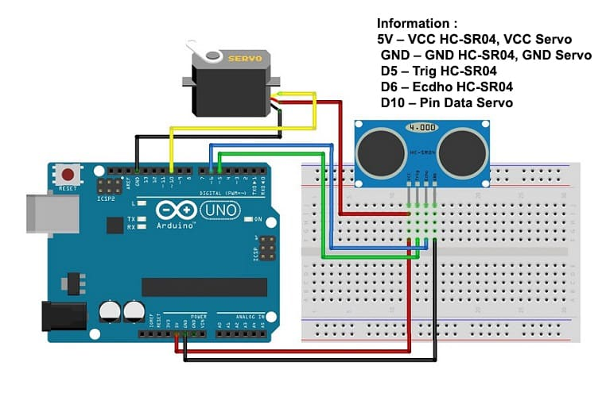

# Rubbish-Bin-Automatic-with-Arduino-Uno

This project automates the opening and closing of a rubbish bin using an Arduino Uno, an ultrasonic sensor (HC-SR04), and a servo motor. The system detects when an object is near the bin and opens the lid automatically.

## Components (Tools and Materials) :

- Arduino IDE or VS Code Studio;
- Library HC-SR04;
- Library Servo;
- Arduino Uno = 1 piece;
- HC-SR04 Ultrasonic Sensor = 1 piece;
- Servo Motor = 1 piece;
- Project Board / Breadboard = 1 piece;
- Rubbish Bin (for Prototype / Maket) = 1 piece;
- Jumper Wires.

## Schematic Picture :

- Below you can see a schematic image to facilitate the wiring of cables from the microcontroller to devices, both input and output sensors:

## Wiring Diagram

- **HC-SR04:**
  - VCC to Arduino 5V
  - GND to Arduino GND
  - Trig to Arduino Pin D5
  - Echo to Arduino Pin D6
- **Servo Motor:**
  - VCC to Arduino 5V
  - GND to Arduino GND
  - Signal to Arduino Pin D10

## Work steps :

- Prepare the tools and materials to be used.
- Carry out the wiring process using Figure schematic of the above circuit
- Open the Arduino IDE software that has been installed on laptop/computer
- Download all the libraries above and insert the library by opening the Arduino IDE, selecting Sketch > Include Library -> Add.Zip Library.
- Type the sketch program on the Arduino IDE page.
- Enter the I2C LCD address in the sketch program.
- Carry out the program uploading process.

## How It Works :

1. **Ultrasonic Sensor:** The HC-SR04 sensor continuously measures the distance to detect when an object (e.g., a hand) is within 10 cm of the bin.
2. **Servo Motor:** When an object is detected, the servo motor rotates to open the bin lid. If no object is detected, the lid remains closed.
3. **Automation Logic:** The lid opens when the sensor detects an object and closes automatically after a delay when the object is no longer detected.

## Code Explanation

- **HCSR04 Library:** Handles the ultrasonic sensor's trigger and echo pins to calculate distance.
- **Servo Library:** Controls the servo motor, allowing it to open and close the bin lid.
- **Distance Calculation:** The distance is measured continuously, and if an object is within 10 cm, the servo motor opens the bin lid.
- **Lid Control:** The servo motor moves from 90° (closed) to 0° (open) when the bin is accessed.

## Installation

1. **Connect the Components:** Assemble the circuit as described in the wiring section.
2. **Upload the Code:** Upload the provided `.ino` file to your Arduino Uno.
3. **Test the System:** Power on the Arduino, and the bin should automatically open when an object is within range.

## Usage

This automated rubbish bin is ideal for maintaining hygiene in kitchens, offices, and other environments where touchless operation is preferred.

## Conclusion:

- The program works by detecting the distance the sensor is from objects (garbage). If the distance is less than specified then the servo will pull the trash can lid so that we can throw away the trash straight away.

